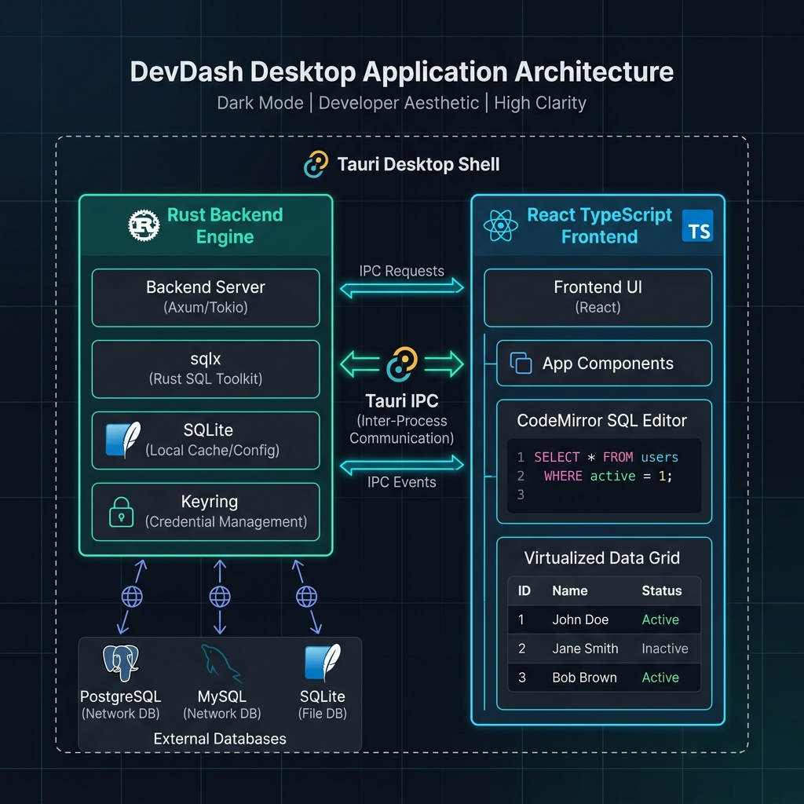

# DevDash — Backend Architecture (Akshat's Module)

A high-performance, minimal, and secure Rust backend engine for **DevDash**, powered by **Tauri 2.x**, **`sqlx::any`**, and **`keyring`**.



---

## 🏛️ Minimal Backend File Structure (`src-tauri/`)

Designed with **zero bloat** — only essential, modular Rust files ensuring maximum maintainability and fast execution.

```text
src-tauri/
├── Cargo.toml                # Dependencies (Tauri, sqlx, keyring, serde, tokio, rusqlite)
├── tauri.conf.json           # Tauri window & IPC security configuration
└── src/
    ├── main.rs               # Entry point & sqlx driver initialization
    ├── lib.rs                # Tauri command registry & app setup
    ├── commands.rs           # #[tauri::command] IPC wrappers for frontend calls
    └── db/
        ├── mod.rs            # Re-exports DB module functions
        ├── pool.rs           # Active connection pool manager (sqlx::any::AnyPool)
        ├── credentials.rs    # Keyring OS secret storage (Keychain/Credential Manager)
        ├── introspection.rs  # Schema, table, column, and Primary Key analysis engine
        ├── executor.rs       # Dynamic SQL execution & row-to-JSON encoder
        ├── staged_edits.rs   # Parameterized UPDATE transaction builder
        └── app_storage.rs    # Embedded SQLite for project-scoped queries & profiles
```

---

## 🛠️ Key Architectural Responsibilities

### 1. Unified Multi-Database Pool (`db/pool.rs`)
- Uses `sqlx::any::AnyPool` to dynamically manage PostgreSQL (`postgres://`), MySQL (`mysql://`), and SQLite (`sqlite://`) connections through a single unified engine.

### 2. OS Keychain Credential Security (`db/credentials.rs`)
- Plaintext database passwords never touch disk or local configuration files.
- Credentials strictly map to system secret vaults via `keyring::Entry::new("devdash", connection_id)`.

### 3. Dynamic Introspection & PK Safety (`db/introspection.rs`)
- Inspects database metadata (`information_schema` / `PRAGMA table_info`).
- Flags tables without single-column primary keys as `read_only = true` to protect against unsafe row updates.

### 4. Staged Edit Engine (`db/staged_edits.rs`)
- Receives dirty cell state batches from frontend.
- Generates parameterized `UPDATE` queries using `sqlx::QueryBuilder` and commits them atomically in a single `sqlx::Transaction`.

### 5. Dynamic SQL Executor (`db/executor.rs`)
- Executes arbitrary user queries, dynamically decoding `AnyRow` into `serde_json::Value` arrays alongside response timing metadata.

### 6. Project-Scoped Saved Queries (`db/app_storage.rs`)
- Embedded SQLite storage (`devdash_internal.db`) maintaining saved queries indexed by host project directory path (`project_path`).

---

## ⚡ Quick Rust Verification

To build and run tests for the backend:

```bash
cd src-tauri
cargo check
cargo test
```
