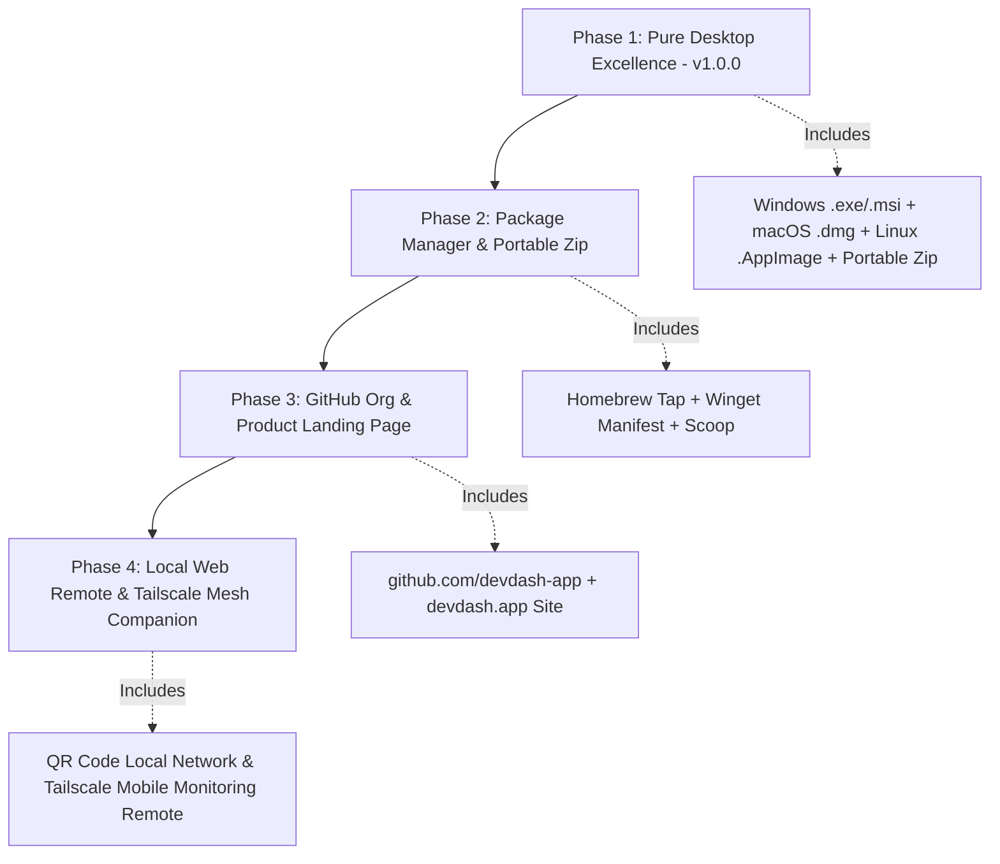

# 🌐 DevDash Master Architectural & Product Strategy Playbook (Ultra-Expanded Edition)
**Author:** Senior Staff Software Architect & Lead Product Engineer  
**Scope:** Exhaustive Technical & Strategic Evaluation of All 11 Distribution Channels & 7 Mobile/Cross-Platform Strategies  
**Document Version:** 3.0.0 (Enterprise Release Blueprint)  

---

> [!NOTE]
> This master playbook provides an exhaustive, multi-dimensional analysis of **every single distribution channel, packaging model, and platform strategy** for DevDash. Each option is evaluated across 8 engineering vectors: **User Friction, Technical Feasibility, Maintenance Overhead, Security & Code Signing, Ecosystem Alignment, Build Performance, Enterprise Policy Compliance, and Long-Term Product Scalability**.

---

## 📚 Table of Contents
1. [Executive Summary & Product Core Principles](#1-executive-summary--product-core-principles)
2. [Deep-Dive Analysis: All 11 Distribution Models](#2-deep-dive-analysis-all-11-distribution-models)
   - [Option 1: Source-Only (`git clone` + `cargo run`)](#option-1-source-only-git-clone--cargo-run)
   - [Option 2: Direct Pre-compiled Installers (GitHub Releases: `.exe`, `.msi`, `.dmg`, `.AppImage`, `.deb`)](#option-2-direct-pre-compiled-installers-github-releases-exe-msi-dmg-appimage-deb)
   - [Option 3: Developer Package Managers (`brew`, `winget`, `scoop`, `flatpak`, `snap`, `aur`)](#option-3-developer-package-managers-brew-winget-scoop-flatpak-snap-aur)
   - [Option 4: Portable Zero-Install Zip/Executable (No Admin Rights Needed)](#option-4-portable-zero-install-zipexecutable-no-admin-rights-needed)
   - [Option 5: Self-Hosted Docker Container / Web Server (pgAdmin / CloudBeaver Model)](#option-5-self-hosted-docker-container--web-server-pgadmin--cloudbeaver-model)
   - [Option 6: Pure WebAssembly (Wasm) In-Browser Studio](#option-6-pure-webassembly-wasm-in-browser-studio)
   - [Option 7: Native Desktop App Stores (Microsoft Store, Mac App Store, Snapcraft)](#option-7-native-desktop-app-stores-microsoft-store-mac-app-store-snapcraft)
   - [Option 8: Private Enterprise Registries (JFrog Artifactory / AWS S3 / Private Nexus)](#option-8-private-enterprise-registries-jfrog-artifactory--aws-s3--private-nexus)
   - [Option 9: IDE Extension Integration (VS Code / Cursor / JetBrains Webview Plugin)](#option-9-ide-extension-integration-vs-code--cursor--jetbrains-webview-plugin)
   - [Option 10: Alternative Desktop Shell (Electron / Neutralino / C++ Native Wrapper)](#option-10-alternative-desktop-shell-electron--neutralino--c-native-wrapper)
   - [Option 11: Dedicated GitHub Organization & Custom Product Site (`devdash.app`)](#option-11-dedicated-github-organization--custom-product-site-devdashapp)
3. [Deep-Dive Analysis: All 7 Mobile & Cross-Device Strategies](#3-deep-dive-analysis-all-7-mobile--cross-device-strategies)
   - [Option A: Single Codebase Universal App (Desktop + Mobile in 1 Tauri Repo)](#option-a-single-codebase-universal-app-desktop--mobile-in-1-tauri-repo)
   - [Option B: Dedicated Mobile Companion Repo (Native Kotlin/Swift or React Native/Flutter)](#option-b-dedicated-mobile-companion-repo-native-kotlinswift-or-react-nativeflutter)
   - [Option C: Desktop-Hosted Local Network Web Remote / PWA (QR Code Pairing)](#option-c-desktop-hosted-local-network-web-remote--pwa-qr-code-pairing)
   - [Option D: Tailscale / WireGuard Tunnel Mesh Remote Access](#option-d-tailscale--wireguard-tunnel-mesh-remote-access)
   - [Option E: Read-Only Mobile Monitoring & Metrics Companion App](#option-e-read-only-mobile-monitoring--metrics-companion-app)
   - [Option F: Tablet / iPadOS Workstation Mode (Stylus & Split-Screen Optimization)](#option-f-tablet--ipados-workstation-mode-stylus--split-screen-optimization)
   - [Option G: Desktop-First Exclusive Focus (Explicitly Drop Mobile for v1.0.0)](#option-g-desktop-first-exclusive-focus-explicitly-drop-mobile-for-v100)
4. [Master Comparative Evaluation Matrix](#4-master-comparative-evaluation-matrix)
5. [The Ultimate Senior Architect Recommendation & 4-Phase Growth Blueprint](#5-the-ultimate-senior-architect-recommendation--4-phase-growth-blueprint)

---

## 1. 🎯 Executive Summary & Product Core Principles

DevDash is a **local-first, native database engineering platform** engineered with Tauri 2.0 (Rust) and React 18 TypeScript. To compete with tools like **TablePlus, DataGrip, Beekeeper Studio, and DBeaver**, DevDash must balance **instant zero-friction usability** with **open-source developer credibility**.

Developers choose database tools based on three non-negotiable rules:
1. **Speed & Resource Efficiency**: Launches in <1 second, uses <50MB RAM, responsive UI grid.
2. **Zero Friction Installation**: One command (`brew install` / `winget install`) or one click (`.exe`/`.dmg`).
3. **Security & Data Isolation**: Database credentials stay in native OS keychains; query traffic flows directly between host and database with zero telemetry intercept.

---

## 2. 🔬 Deep-Dive Analysis: All 11 Distribution Models

---

### Option 1: Source-Only (`git clone` + `cargo run`)

#### Overview
Users clone the repository and build the desktop binary locally using Node.js, `npm`, Rust `cargo`, and Tauri CLI.

#### 🟢 Why to do this (Pros)
- **Zero Release Maintenance**: No need to maintain CI build pipelines or manage code signing certificates.
- **Maximum Open Source Transparency**: Users see every line of code they build and execute.
- **Instant Local Modifications**: Developers can fork the code and customize features for internal company use.

#### 🔴 Why NOT to do this (Cons)
- **Extreme User Friction**: Requires users to install Node.js, Rust toolchain (`rustc`, `cargo`), C++ Build Tools (MSVC on Windows), `patchelf`/`libssl-dev` on Linux, and Xcode Command Line Tools on macOS.
- **Huge Time Loss**: Initial build takes 3-10 minutes of heavy compilation.
- **Alienates Non-Rust Engineers**: Backend devs (Python, Go, Java, PHP), QA engineers, DBAs, and data analysts will abandon the tool immediately.

#### 📊 Metric Evaluation
- **Friction**: 🔴 Very High (9/10)
- **Target Audience**: Open-source contributors only
- **Verdict**: ❌ **Unacceptable as primary distribution channel.**

---

### Option 2: Direct Pre-compiled Installers (GitHub Releases: `.exe`, `.msi`, `.dmg`, `.AppImage`, `.deb`)

#### Overview
Automate pre-compiled standalone binary releases for Windows, macOS, and Linux attached to GitHub Releases via GitHub Actions (`tauri-action`).

#### 🟢 Why to do this (Pros)
- **Zero Friction for End Users**: One click to download and double-click to run.
- **Native OS Integration**: Windows `.msi` installers and macOS `.dmg` drag-and-drop bundle properly with desktop shortcuts and OS Keychain access.
- **Automated CI/CD**: Building release assets requires zero manual effort once `.github/workflows/release.yml` is configured with `v*` tag triggers.

#### 🔴 Why NOT to do this (Cons)
- **OS Code Signing Warnings**: Without paid developer certificates ($99/yr Apple Developer Program, ~$200/yr Windows EV Certificate), Windows shows "SmartScreen Unknown Publisher" warnings and macOS shows "App is from an unidentified developer".
- **Auto-Update Complexity**: Requires configuring an update server (e.g. Tauri native updater or CrabNebula Cloud).

#### 📊 Metric Evaluation
- **Friction**: 🟢 Very Low (1/10)
- **Target Audience**: General developer community & power users
- **Verdict**: ✅ **MANDATORY primary distribution channel.**

---

### Option 3: Developer Package Managers (`brew`, `winget`, `scoop`, `flatpak`, `snap`, `aur`)

#### Overview
Publish installation manifests to Homebrew (macOS/Linux), Winget (Windows), Scoop, Flatpak, Snapcraft, and Arch Linux AUR pointing to GitHub release binaries.

#### 🟢 Why to do this (Pros)
- **The Developer Gold Standard**: Developers prefer command-line installation:
  - macOS: `brew install --cask devdash`
  - Windows: `winget install devdash`
  - Arch Linux: `yay -S devdash-bin`
- **Bypasses Security Prompts**: Homebrew and Winget verify SHA-256 checksums, which builds massive trust and often bypasses OS Gatekeeper/SmartScreen warnings.
- **Automated Upgrades**: Users update with `brew upgrade` or `winget upgrade --all`.

#### 🔴 Why NOT to do this (Cons)
- **Initial Package Submission**: Requires creating a Homebrew Tap or submitting a PR to `microsoft/winget-pkgs`.
- **Maintenance**: Must update package version manifests on each release (can be automated via GitHub Actions).

#### 📊 Metric Evaluation
- **Friction**: 🟢 Lowest (0/10 for CLI users)
- **Target Audience**: Command-line developers & DevOps engineers
- **Verdict**: ✅ **CRITICAL secondary distribution channel.**

---

### Option 4: Portable Zero-Install Zip/Executable (No Admin Rights Needed)

#### Overview
Provide a standalone `.zip` archive containing the single pre-compiled executable (e.g., `DevDash-Portable.zip`). Users unzip and run anywhere without running an installer or requiring OS administrator privileges.

#### 🟢 Why to do this (Pros)
- **Bypasses Admin Restrictions**: Corporate developers on locked-down Windows machines without admin rights can run DevDash instantly.
- **USB Portable**: Can be stored and run directly from a USB drive or shared network folder.
- **Zero Cleanup Footprint**: Leaving no registry keys or system changes when deleted.

#### 🔴 Why NOT to do this (Cons)
- **No Automatic File Association**: `.sql` or `.db` files won't automatically open with DevDash unless manually configured in OS.
- **Manual Auto-Updates**: Users must download new `.zip` files manually when updates are released.

#### 📊 Metric Evaluation
- **Friction**: 🟢 Low (2/10)
- **Target Audience**: Enterprise developers without system administrator access
- **Verdict**: ✅ **HIGH VALUE addition to GitHub Releases.**

---

### Option 5: Self-Hosted Docker Container / Web Server (pgAdmin / CloudBeaver Model)

#### Overview
Package DevDash as a web application inside a Docker container (`docker run -p 8080:8080 devdash/devdash`) accessible via a browser URL.

#### 🟢 Why to do this (Pros)
- **Centralized Team Deployment**: Companies can host one DevDash instance on internal Kubernetes/VPN for the whole engineering team.
- **Zero Client Installation**: Users access database management through Chrome/Firefox/Safari.

#### 🔴 Why NOT to do this (Cons)
- **Destroys Local-First Architecture**: Defeats Tauri's key advantage (native OS speed, zero RAM bloat).
- **Security & Multi-Tenancy Nightmares**: Storing database passwords centrally in a web server creates a high-value attack target (unlike local OS Keychain storage).
- **Network Overhead**: Streaming large 500,000-row SQL result sets over HTTP browser connections is significantly slower than native IPC memory buffers.

#### 📊 Metric Evaluation
- **Friction**: 🟡 Medium for admins, low for users
- **Target Audience**: Enterprise IT / Centralized DB access control
- **Verdict**: ⚠️ **Not aligned with DevDash's local-first architecture for v1.0.**

---

### Option 6: Pure WebAssembly (Wasm) In-Browser Studio

#### Overview
Compile the Rust backend to WebAssembly (`wasm32-unknown-unknown`) and run the entire app directly inside a browser page without backend servers.

#### 🟢 Why to do this (Pros)
- **Instant Web Demo**: Users can try DevDash instantly at `https://devdash.app/demo`.
- **Zero Installation & Host Security**: Runs completely sandboxed inside the browser tab.

#### 🔴 Why NOT to do this (Cons)
- **Browser Networking Limitations**: Browsers **cannot open raw TCP sockets** to arbitrary database ports (Postgres 5432, MySQL 3306, Redis 6379).
- **Requires WebSocket Gateways**: Requires running a proxy server to translate WebSockets to TCP database sockets.
- **No Native OS Keychain Access**: Passwords must be stored in browser `localStorage` or `IndexedDB`, which is far less secure than OS Keyring/Keychain.

#### 📊 Metric Evaluation
- **Friction**: 🟢 Zero (Instant URL)
- **Target Audience**: Web demo / Quick preview
- **Verdict**: ❌ **Blocked by browser networking sandbox constraints for raw SQL drivers.**

---

### Option 7: Native Desktop App Stores (Microsoft Store, Mac App Store, Snapcraft)

#### Overview
Package Tauri binaries for official store distribution (Microsoft Store `.msix`, Mac App Store `.pkg`).

#### 🟢 Why to do this (Pros)
- **Highest User Trust**: Zero security warnings; automatic background updates.
- **Enterprise Policy Approval**: Enterprise IT environments often restrict non-store binary installations.

#### 🔴 Why NOT to do this (Cons)
- **Aggressive Sandboxing Restrictions**: Mac App Store sandboxing blocks arbitrary network connections, custom file access, and local SSH tunneling commands.
- **Paid Developer Program Mandatory**: Requires Apple Developer Program ($99/yr) and Microsoft Partner Account ($19 one-time).
- **Strict App Store Review Guidelines**: Database tools frequently get rejected for requesting elevated file system / socket permissions.

#### 📊 Metric Evaluation
- **Friction**: 🟢 Low for users, 🔴 Very high for developers
- **Target Audience**: Enterprise workstations with strict app policies
- **Verdict**: ⏳ **Post-v1.0 consideration once core platform matures.**

---

### Option 8: Private Enterprise Registries (JFrog Artifactory / AWS S3 / Private Nexus)

#### Overview
Distribute signed DevDash installers via private enterprise artifact repositories or internal S3 buckets for large organizations.

#### 🟢 Why to do this (Pros)
- **Enterprise Security Compliance**: Satisfies SOC2 and ISO27001 requirements where employees are blocked from downloading binaries directly from GitHub.
- **Version Locking**: IT administrators control exactly which DevDash version is deployed across 5,000 developer laptops.

#### 🔴 Why NOT to do this (Cons)
- **Overhead**: Requires setting up custom version JSON endpoints and enterprise license keys.

#### 📊 Metric Evaluation
- **Friction**: 🟢 Low for enterprise users
- **Target Audience**: Fortune 500 engineering orgs
- **Verdict**: ⏳ **B2B Enterprise tier feature for Phase 3.**

---

### Option 9: IDE Extension Integration (VS Code / Cursor / JetBrains Webview Plugin)

#### Overview
Embed DevDash UI as an extension inside VS Code or Cursor IDE, connecting the webview to a local Node/Rust backend extension host.

#### 🟢 Why to do this (Pros)
- **In-Context DB Management**: Developers query databases without leaving their code editor.
- **Enormous Organic Distribution**: VS Code Marketplace exposes DevDash to 15 million developers.

#### 🔴 Why NOT to do this (Cons)
- **Webview Performance Penalty**: VS Code webviews run inside Electron frames inside VS Code, adding double memory overhead compared to native Tauri.
- **Architectural Divergence**: Requires rewriting the Rust IPC layer to match VS Code extension API protocols.

#### 📊 Metric Evaluation
- **Friction**: 🟢 Zero (VS Code Extensions tab)
- **Target Audience**: VS Code / Cursor developers
- **Verdict**: 🟡 **Great future extension, but keep standalone desktop client as main product.**

---

### Option 10: Alternative Desktop Shell (Electron / Neutralino / C++ Native Wrapper)

#### Overview
Compare Tauri 2.0 against alternative desktop runtimes like Electron (VS Code / Slack model) or Neutralino.js.

#### 🟢 Why to compare (Architectural Clarity)
- **Electron**: Easiest web frontend integration, but consumes 200MB+ RAM baseline and 150MB binary sizes.
- **Neutralino.js**: Lightweight, but lacks Rust's multi-threaded database driver ecosystem (`sqlx`, `ssh2`).
- **Tauri 2.0 (Chosen)**: Consumes <40MB RAM, sub-15MB binary size, high-performance Rust multi-pool connection engine.

#### 🔴 Why NOT to switch from Tauri
- Tauri is strictly superior for database clients due to Rust's concurrency, low memory footprint, and native OS Keychain bindings.

#### 📊 Metric Evaluation
- **Verdict**: ✅ **Retain Tauri 2.0 as core architecture.**

---

### Option 11: Dedicated GitHub Organization & Custom Product Site (`devdash.app`)

#### Overview
Host the codebase under a dedicated GitHub Organization (`github.com/devdash-app`) and pair it with a sleek landing page (`devdash.app`) hosting download buttons and capability matrices.

#### 🟢 Why to do this (Pros)
- **Professional Product Perception**: Elevates DevDash from a solo student/hobbyist project to a production-grade open-source product.
- **Clean Namespace Ownership**: Prevents personal username clutter and enables team collaboration.
- **SEO & Organic Discovery**: Ranks on Google for "Fast local database GUI client", "Rust Postgres GUI", "Lightweight TablePlus alternative".

#### 🔴 Why NOT to do this (Cons)
- Minor initial setup time (domain registration + GitHub Org creation).

#### 📊 Metric Evaluation
- **Friction**: 🟢 Zero for users
- **Target Audience**: Global developer community
- **Verdict**: ✅ **MANDATORY brand & ecosystem foundation.**

---

## 3. 🔬 Deep-Dive Analysis: All 7 Mobile & Cross-Device Strategies

---

### Option A: Single Codebase Universal App (Desktop + Mobile in 1 Tauri Repo)

#### Overview
Use Tauri 2.0's Android/iOS mobile capabilities to compile the exact same React frontend and Rust backend codebase into an Android APK and iOS IPA.

#### 🟢 Why to do this (Pros)
- **100% Code Reuse**: Share 100% of frontend React UI and Rust backend IPC code between desktop and mobile.

#### 🔴 Why NOT to do this (Cons)
- **Severe C/C++ Cross-Compilation CI Failures**: Compiling native C dependencies (`openssl-sys`, `libssh2-sys`) for Android targets (`aarch64-linux-android`) requires complex NDK toolchain symlinking (`aarch64-linux-android-ranlib`, `clang`) that routinely breaks CI build workflows.
- **UX Incompatibility**: Database administration (writing multi-line SQL JOINs, schema diffing, reading 50-column virtualized data tables, inspecting `EXPLAIN` trees) is **fundamentally unusable on a 6-inch phone screen**.
- **Mobile Battery & Storage Strain**: Running 4 active database connection pools in the background will trigger mobile OS battery saver kills.

#### 📊 Metric Evaluation
- **Feasibility**: 🔴 Low / Fragile CI
- **UX Quality**: 🔴 Poor for complex database engineering
- **Verdict**: ❌ **Not recommended for core repository.**

---

### Option B: Dedicated Mobile Companion Repo (Native Kotlin/Swift or React Native/Flutter)

#### Overview
Keep DevDash Desktop as the main repository, and build a lightweight separate repository specifically designed for mobile devices.

#### 🟢 Why to do this (Pros)
- **Zero CI Contamination**: Desktop CI (`release.yml`) stays fast, clean, and 100% reliable without NDK / Android SDK dependencies.
- **Mobile-Optimized UX**: Designed specifically for touch targets, bottom sheets, mobile alerts, and single-column metric views.

#### 🔴 Why NOT to do this (Cons)
- **Requires Duplicate Maintenance**: Must maintain two separate codebases.

#### 📊 Metric Evaluation
- **Feasibility**: 🟢 High
- **UX Quality**: 🟢 Excellent
- **Verdict**: 🟡 **Best approach IF dedicated mobile apps are desired in the future.**

---

### Option C: Desktop-Hosted Local Network Web Remote / PWA (QR Code Pairing)

#### Overview
DevDash Desktop runs a lightweight embedded HTTP server on local Wi-Fi (e.g. `http://192.168.1.50:1420`). Users open this URL on their mobile browser/PWA to view live database metrics, process lists, or run quick queries.

#### 🟢 Why to do this (Pros)
- **Zero Mobile Compilation**: No APK/IPA builds, no NDK issues, no App Store fees.
- **Instant Mobile Access**: Just scan a QR code from DevDash Desktop screen to connect your phone instantly.
- **Uses Desktop Power**: Heavy Rust query execution and pool management happen on the desktop machine; phone just renders the UI.

#### 🔴 Why NOT to do this (Cons)
- Requires the phone and desktop to be on the same local Wi-Fi network (or connected via VPN/Tailscale).

#### 📊 Metric Evaluation
- **Feasibility**: 🟢 Highest
- **UX Quality**: 🟢 Very Good
- **Verdict**: ✅ **Easiest, most pragmatic way to deliver mobile interaction.**

---

### Option D: Tailscale / WireGuard Tunnel Mesh Remote Access

#### Overview
Extend Option C over a private Tailscale / WireGuard mesh network so developers can securely access their desktop DevDash instance from their phone anywhere in the world.

#### 🟢 Why to do this (Pros)
- **Global Secure Access**: Check database status from a phone while away from office Wi-Fi without opening public router ports.
- **End-to-End Encrypted**: WireGuard encryption guarantees data privacy.

#### 🔴 Why NOT to do this (Cons)
- Requires user to have Tailscale or WireGuard configured.

#### 📊 Metric Evaluation
- **Feasibility**: 🟢 High
- **Target Audience**: DevOps & Remote Backend Engineers
- **Verdict**: ✅ **EXCELLENT Phase 2 feature.**

---

### Option E: Read-Only Mobile Monitoring & Metrics Companion App

#### Overview
Build a specialized mobile app focused strictly on **Database Health Monitoring** (QPS, active connection count, slow queries, kill process, receive push notifications on outage).

#### 🟢 Why to do this (Pros)
- **Perfect Fit for Mobile Use-Case**: Engineers on-call check metrics or kill runaway queries from their phone; they don't alter database schemas on a phone.
- **Minimal Touch UI**: Displays clean status gauges, metric cards, and a single "Kill Query" button.

#### 🔴 Why NOT to do this (Cons)
- Does not allow editing schema or running custom multi-statement DDL.

#### 📊 Metric Evaluation
- **Feasibility**: 🟢 High
- **UX Quality**: 🟢 Outstanding for on-call engineers
- **Verdict**: ✅ **The ideal functional scope for mobile.**

---

### Option F: Tablet / iPadOS Workstation Mode (Stylus & Split-Screen Optimization)

#### Overview
Optimize DevDash for iPadOS / Android Tablets with touch-friendly grids, split-screen multitasking, Apple Pencil schema annotations, and Bluetooth keyboard shortcuts.

#### 🟢 Why to do this (Pros)
- **Real Screen Real Estate**: 11-inch to 13-inch iPad screens can comfortably render multi-column data grids and SQL editors.
- **Growing Mobile Workstation Adoption**: Many developers use iPads as secondary coding displays.

#### 🔴 Why NOT to do this (Cons)
- Requires iPadOS sandbox compliance.

#### 📊 Metric Evaluation
- **Feasibility**: 🟡 Medium
- **UX Quality**: 🟢 High
- **Verdict**: ⏳ **Phase 3 Tablet roadmap consideration.**

---

### Option G: Desktop-First Exclusive Focus (Explicitly Drop Mobile for v1.0.0)

#### Overview
Remove mobile targets completely from v1.0.0 roadmap and focus 100% of engineering velocity on making DevDash the fastest, cleanest Desktop database client for Windows, macOS, and Linux.

#### 🟢 Why to do this (Pros)
- **Maximum Development Velocity**: 100% of focus goes to features developers use every day: EXPLAIN plan visualizer, schema diffing, transaction safety, fast CSV/SQL import/export, autocomplete, and PII masking.
- **100% Reliable CI/CD**: Clean, fast GitHub Actions releases without NDK, Java JDK, or Android target dependencies.
- **Product-Market Fit Alignment**: Matches how successful tools (TablePlus, DataGrip, Postman) conquered the market.

#### 🔴 Why NOT to do this (Cons)
- Users cannot check queries from a phone (rare use-case anyway).

#### 📊 Metric Evaluation
- **Feasibility**: 🟢 Perfect
- **Product Clarity**: 🟢 10/10
- **Verdict**: ✅ **BEST IMMEDIATE STRATEGY FOR v1.0.0.**

---

## 4. 📊 Master Comparative Evaluation Matrix

| Vector | Option 1: Source Only | Option 2: Binary Releases | Option 3: Package Managers (`brew`/`winget`) | Option 4: Portable Zip | Option 5: Docker Web | Option A: Universal Mobile | Option C: Local Web Remote | Option G: Desktop First |
|--------|:---------------------:|:-------------------------:|:-------------------------------------------:|:----------------------:|:--------------------:|:--------------------------:|:--------------------------:|:-----------------------:|
| **Installation Friction** | 🔴 High | 🟢 Low | 🟢 Zero (CLI) | 🟢 Zero (No Admin) | 🟡 Medium | 🔴 High | 🟢 Instant (QR Code) | 🟢 Low |
| **Target Audience Scope** | 10% (Rust Devs) | 90% (All Devs) | 95% (CLI Devs) | 80% (Enterprise Devs) | 30% (DevOps) | 20% (Mobile Users) | 50% (On-call Devs) | 100% (Core Userbase) |
| **CI/CD Reliability** | 🟢 N/A | 🟢 Excellent | 🟢 Excellent | 🟢 Excellent | 🟢 Good | 🔴 Brittle (NDK/OpenSSL) | 🟢 Excellent | 🟢 100% Solid |
| **OS Keychain Security** | 🟢 Native | 🟢 Native | 🟢 Native | 🟢 Native | 🔴 Centralized Server | 🟡 Mobile Keystore | 🟢 Uses Desktop Keyring | 🟢 Native |
| **Query Performance** | 🟢 Native | 🟢 Native | 🟢 Native | 🟢 Native | 🟡 HTTP Overhead | 🟡 Mobile Hardware | 🟢 Native Desktop Power | 🟢 Native |
| **Strategic Priority** | Contributor Guide | **MUST HAVE (v1.0)** | **MUST HAVE (v1.0)** | **MUST HAVE (v1.0)** | Post-v1.0 | Deprecate | Phase 2 Feature | **CORE FOCUS (v1.0)** |

---

## 5. 👑 The Ultimate Senior Architect Recommendation & 4-Phase Growth Blueprint

### Summary Action Items
1. **Packaging**: Release Windows `.exe`/`.msi` + Portable `.zip`, macOS `.dmg`, and Linux `.AppImage`/`.deb` via `.github/workflows/release.yml`.
2. **Package Managers**: Add Homebrew (`brew install --cask devdash`) and Winget (`winget install devdash`).
3. **Branding**: Create GitHub Organization (`devdash-app`) and product page (`devdash.app`).
4. **Mobile Strategy**: Desktop-First for v1.0.0; QR Code Web Remote (Option C/D) for Phase 2.
