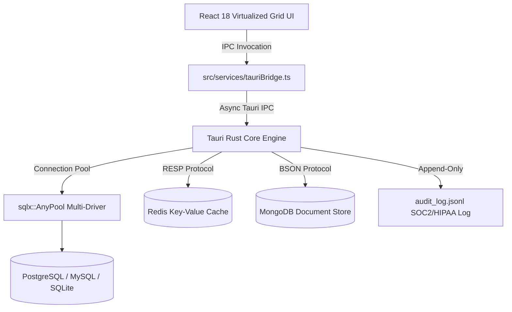

<div align="center">

# ⚡ DevDash
### Local-First Database Engineering Platform & Native GUI Client

[](https://tauri.app/)
[](https://www.rust-lang.org/)
[](https://react.dev/)
[](LICENSE)
[](https://github.com/GUNPARK-GOOKIM/DevDash)

**DevDash** is a high-performance **local-first database engineering platform** and native desktop GUI client built with a **Tauri 2.0 + Rust core** and **React 18 TypeScript**. Using **less than 20MB of RAM** (vs 300MB+ in Electron), DevDash delivers git-style transactional diff staging, visual EXPLAIN execution plan cost trees, 100% offline local AI, bento health telemetry, NoSQL inspectors, and enterprise compliance tools.

[Architecture Reference](PROGRESS.md) • [Capability Status](#-capability--status-matrix) • [Key Features](#-key-features) • [Download](#-download--installation) • [OS Bypass Guide](#-os-security--bypass-guide)

</div>

---

<div align="center">
  <h3>📹 Live Workspace Interaction & Animation</h3>
  
</div>

---

## 📊 Capability & Status Matrix

| Engine & Feature Capability | Implementation Status | Core Module / Driver |
|-----------------------------|:---------------------:|----------------------|
| **Multi-Driver SQL Query Engine** (Postgres, MySQL, SQLite, MSSQL, CockroachDB) | ✅ Completed | `src-tauri/src/db/pool.rs` (`sqlx::AnyPool`) |
| **Git-Style Transactional Diff Staging** (old→new diff review before commit) | ✅ Completed | `src-tauri/src/db/staged_edits.rs` + `StagingCommit.tsx` |
| **100% Offline Local AI SQL Assistant** (Ollama / `qwen2.5-coder` / Claude / OpenAI) | ✅ Completed | `src/components/AiAgentBar.tsx` (`Cmd+K`) |
| **Visual EXPLAIN Execution Plan Cost Visualizer** (Cost bars & scan alerts) | ✅ Completed | `src/components/ExplainVisualizer.tsx` |
| **6-Card Recharts Bento Telemetry Grid** (CPU, RAM, cache hit, locks, latency) | ✅ Completed | `src/components/HealthGrid.tsx` |
| **NoSQL Key-Value & BSON Document Inspectors** (Redis RESP & Mongo BSON) | ✅ Completed | `src/components/NoSqlInspector.tsx` |
| **Stored Routine Debugger & Parameter Runner** (PL/pgSQL / T-SQL / MySQL) | ✅ Completed | `src/components/RoutinesManager.tsx` |
| **Visual User & Privilege Matrix Manager** (7-permission `GRANT`/`REVOKE` matrix) | ✅ Completed | `src/components/RolesManager.tsx` |
| **SOC2 / HIPAA Append-Only Audit Logger** (`audit_log.jsonl` logger) | ✅ Completed | `src-tauri/src/db/audit.rs` + `AuditLoggerModal.tsx` |
| **Live DDL Schema Diff & Migration Sync Generator** (`Dev` vs `Prod` sync) | ✅ Completed | `src/components/SchemaDiffModal.tsx` |
| **Automatic Data Masking & PII Protection Engine** (GDPR pattern rules) | ✅ Completed | `src/components/PiiMaskingConfig.tsx` |
| **Visual No-Code Query Builder & Synthetic Mock Seed Generator** | ✅ Completed | `VisualQueryBuilder.tsx` + `MockDataGenerator.tsx` |
| **Spreadsheet Grid Editing & 2D TSV Range Copy/Paste** (`Shift+Arrow`, `Ctrl+C/V`) | ✅ Completed | `src/components/TableGrid.tsx` |

---

## 📸 Interactive Workspace Showcase

<div align="center">
  
</div>

<div align="center">
  
  
</div>

<div align="center" style="margin-top: 16px;">
  
  
</div>

---

## 🏗️ Architecture & System Execution Flow



<div align="center">
  
</div>

---

## ✨ Key Features

### 🛡️ Git-Style Transaction Staging & Safe Mode
- **Review Before Commit**: Edits made in the virtual grid are staged locally as color-coded cell diffs (`old_value → new_value`). Nothing touches production until you review and click **Apply Staged Edits**.
- **Safe Mode Shield**: Destructive SQL queries (`DROP`, `TRUNCATE`, or `UPDATE`/`DELETE` without a `WHERE` clause) trigger a high-visibility warning modal with query analysis before execution.

### 🤖 100% Offline Local AI SQL Assistant
- **Privacy-First AI**: Connect directly to your local **Ollama** instance (`qwen2.5-coder`, `llama3`, `codellama`) for zero-latency, 100% offline natural-language-to-SQL generation.
- **Cloud LLM Support**: Optionally configure Anthropic Claude or OpenAI API keys.
- **Cmd+K Command Palette**: Press `Cmd+K` anywhere in the app to prompt AI for SQL queries, schema refactoring, or query optimization suggestions.

### ⚡ Blazing Performance (~20MB RAM Footprint)
- **Rust Engine Core**: Multi-pool database execution managed by `sqlx::AnyPool` and concurrent `DashMap` storage in native Rust binaries.
- **60fps Virtualized Data Grid**: Render datasets with 100,000+ rows smoothly using `@tanstack/react-virtual`.
- **Chunked Result Streaming**: Stream dynamic query results over Tauri IPC in 500-row chunks to prevent RAM bloating.

---

## 💻 Download & Installation

### Option 1: Direct Download (Pre-Compiled Binary)
Download the latest installer for your operating system directly from GitHub Releases:

- **🪟 Windows**: [`DevDash-Setup-x64.exe`](../../releases/latest) or `.msi`
- **🍏 macOS**: [`DevDash-x64-arm64.dmg`](../../releases/latest) (Apple Silicon M1/M2/M3 & Intel)
- **🐧 Linux**: [`DevDash.AppImage`](../../releases/latest) or `.deb`

👉 **[Go to GitHub Releases](../../releases/latest)**

---

## 🛡️ OS Security & Bypass Guide

Because DevDash is an open-source project and installers are compiled directly from source without paid corporate developer certificates, macOS Gatekeeper and Windows SmartScreen may display a security prompt on initial launch.

### 🍏 macOS Fix (If blocked by Gatekeeper):
* **Method 1 (Right-Click Open - Recommended)**: Right-click `DevDash.app` in Finder → Click **Open** → Click **Open Anyway**.
* **Method 2 (Terminal Command)**: Open Terminal and run:
  ```bash
  xattr -d com.apple.quarantine /Applications/DevDash.app
  ```
* **Method 3 (Allow Anywhere)**: Open Terminal and run `sudo spctl --master-disable`, then select "Anywhere" in **System Settings → Privacy & Security**.

### 🪟 Windows Fix (If blocked by SmartScreen):
* When the blue "Windows protected your PC" dialog appears, click **More info** → Click **Run anyway**.

---

## 🚀 Developer Quickstart & Verification

```bash
# 1. Clone the Repository
git clone https://github.com/GUNPARK-GOOKIM/DevDash.git
cd DevDash

# 2. Install Frontend Dependencies
npm install

# 3. Type-check Frontend
npx tsc --noEmit

# 4. Run Architecture Integrity Audit
python scripts/check-architecture.py

# 5. Run in Development Mode
npm run dev

# 6. Compile Production Desktop Installers
npm run build
npm run tauri build
```

---

## 📄 License

Distributed under the **Apache License 2.0**. See [`LICENSE`](LICENSE) for details.

<div align="center">
  <sub>Built with ❤️ by the DevDash Engineering Team. Crafted with Rust, Tauri, and React.</sub>
</div>
