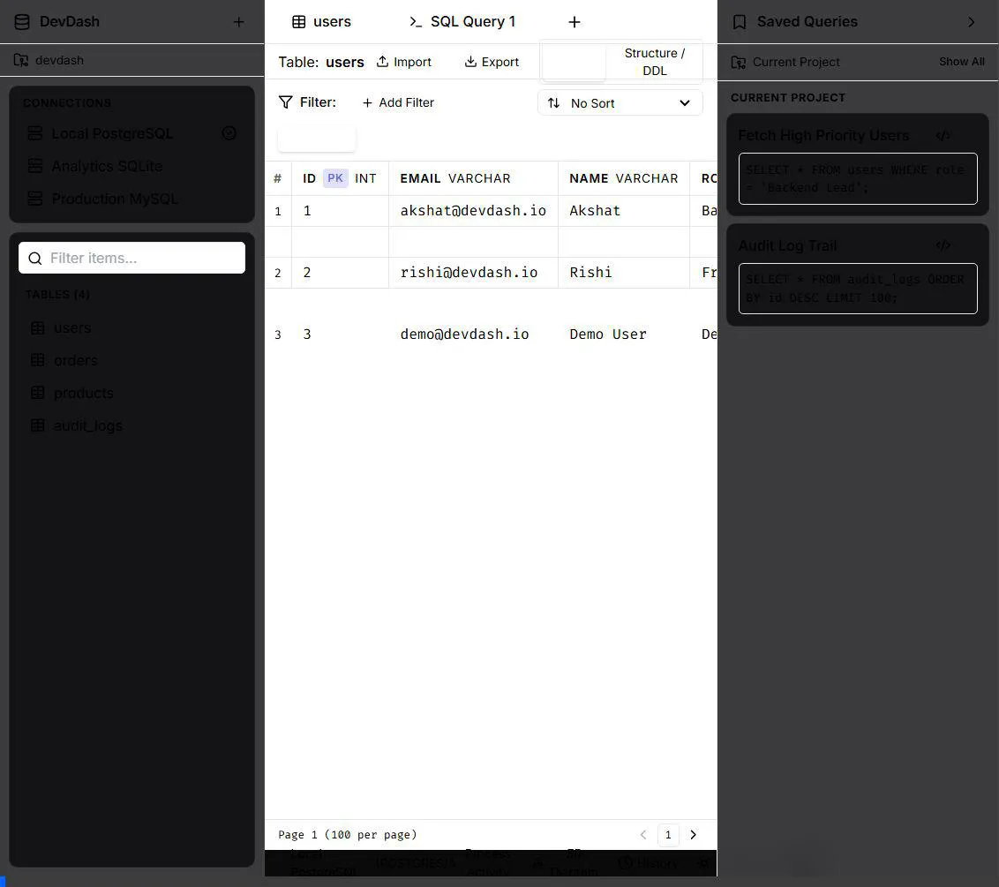
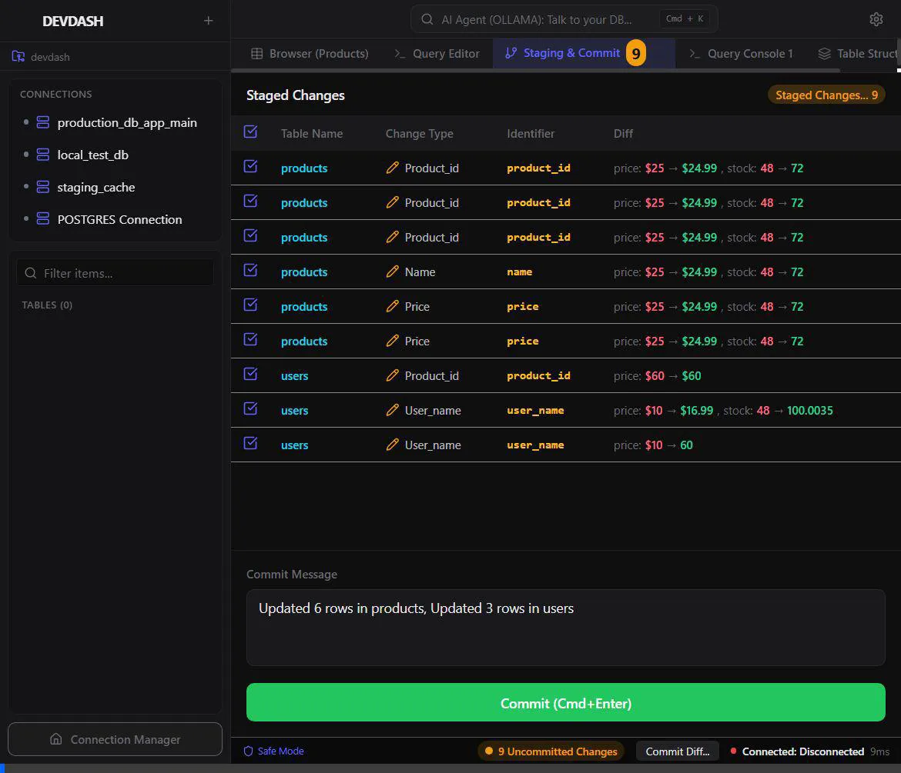
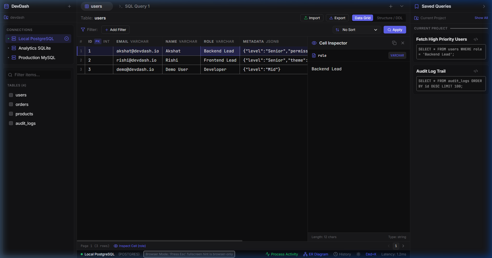
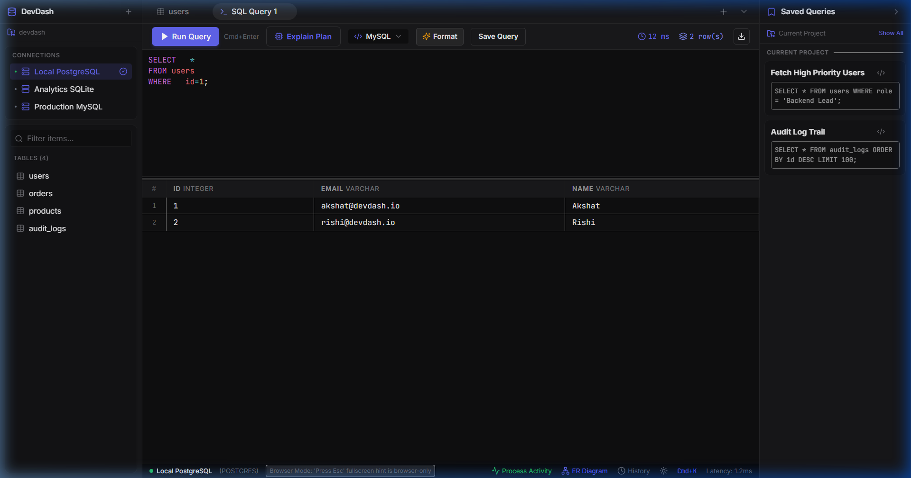
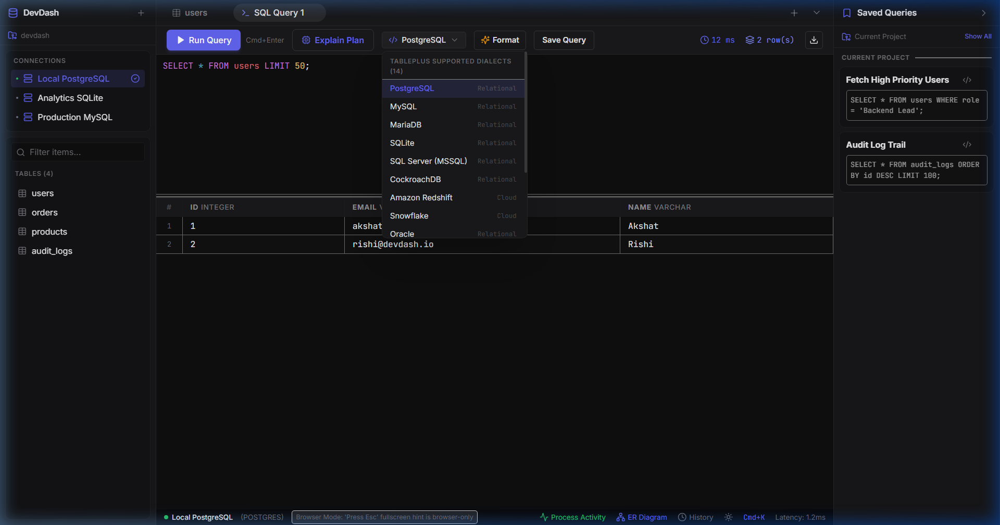
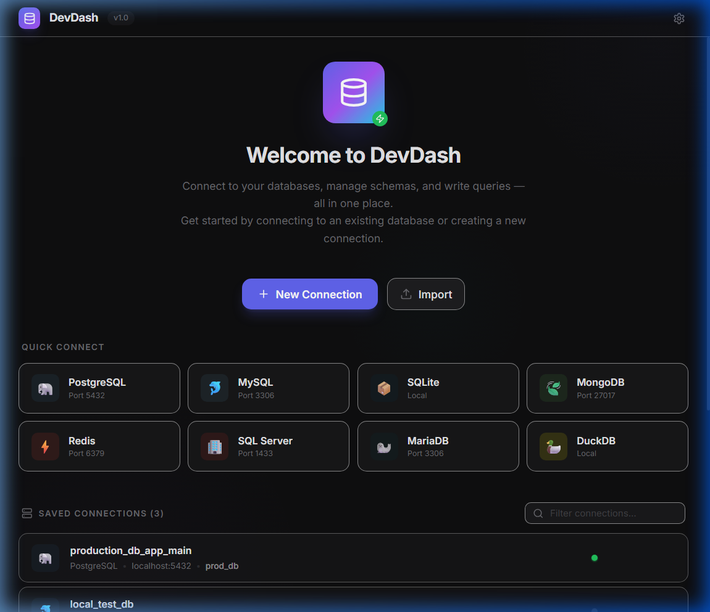
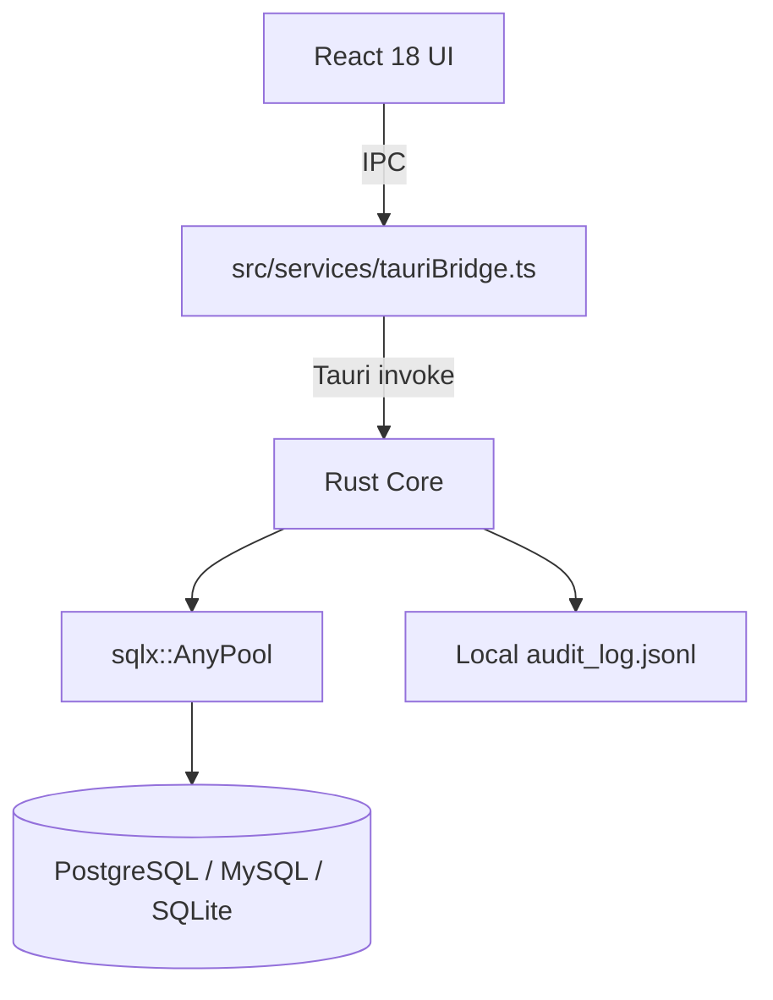

<div align="center">

# ⚡ DevDash
### Local-First Database Engineering Platform & Native GUI Client

[](https://tauri.app/)
[](https://www.rust-lang.org/)
[](https://react.dev/)
[](LICENSE)
[](https://github.com/GUNPARK-GOOKIM/DevDash)

**DevDash** is a **local-first native database GUI client** built with **Tauri 2.0 + Rust** and **React 18 TypeScript**. Core SQL workflows (connect, introspect, query, stage/edit, export/import) target **PostgreSQL, MySQL/MariaDB, and SQLite** (plus Postgres wire-compat engines CockroachDB/Redshift). Several advanced UI surfaces exist as prototypes and are **not** production-complete — see the status matrix below.

[Architecture Reference](docs/ARCHITECTURE.md) • [Capability Status](#-capability--status-matrix) • [Key Features](#-key-features) • [Download](#-download--installation) • [OS Bypass Guide](#-os-security--bypass-guide)

</div>

---

<div align="center">
  <h3>📹 Live Workspace Interaction & Animation</h3>
  
</div>

---

## 📊 Capability & Status Matrix

Status meanings: **Complete** = end-to-end from UI through Rust IPC to real engines · **Partial** = real backend pieces but incomplete UX/wiring · **UI prototype** = frontend demo data only · **Missing** = not implemented.

| Engine & Feature Capability | Status | Evidence |
|-----------------------------|:------:|----------|
| **SQL drivers: Postgres / MySQL / MariaDB / SQLite** | ✅ Complete | `sqlx` features in `Cargo.toml`; `pool.rs` + `introspection.rs` |
| **CockroachDB / Redshift** | ⚠️ Partial | Treated as Postgres wire protocol; not separately tested |
| **MSSQL / Oracle / Snowflake / DuckDB / BigQuery / Turso** | ❌ Missing | UI options only; backend rejects unsupported engines |
| **Redis / MongoDB / Cassandra** | ❌ UI prototype | `NoSqlInspector.tsx` used hardcoded demo data; no RESP/BSON drivers |
| **Connect / introspect / run SQL / stream results** | ✅ Complete | `commands.rs`, `executor.rs`, `tauriBridge.ts` |
| **Git-style staged cell edits + transactional commit** | ⚠️ Partial | Backend `staged_edits.rs` works; frontend now wires commit (string-built SQL, not bind params) |
| **Safe Mode destructive SQL gate** | ✅ Complete | `safe_mode.rs` + confirmation modal |
| **OS keychain passwords** | ✅ Complete | `credentials.rs` via `keyring` |
| **SSH tunnel** | ⚠️ Partial | `ssh_tunnel.rs` opens local forward; session-per-connection is heavy / limited |
| **Local AI (Ollama) + cloud LLM providers** | ⚠️ Partial | Browser `fetch` to Ollama/OpenAI/Claude from UI — works when configured; not “built-in offline AI” |
| **EXPLAIN plan visualizer** | ❌ UI prototype | `ExplainVisualizer.tsx` ships a hardcoded demo plan tree |
| **Health / metrics grid** | ⚠️ Partial | Live metrics IPC for PG/MySQL/SQLite; no fake CPU/RAM; QPS/slow queries limited |
| **Routines manager** | ❌ UI prototype | Hardcoded demo routines |
| **Roles / privilege matrix** | ❌ UI prototype | Hardcoded demo users/roles |
| **Audit log (local JSONL)** | ⚠️ Partial | Append-only JSONL + IPC reader; **not** SOC2/HIPAA certified |
| **Schema diff modal (Dev vs Prod)** | ❌ UI prototype | Hardcoded migration DDL in `SchemaDiffModal.tsx` (footer marked `*`) |
| **Per-table migration SQL helper** | ⚠️ Partial | Backend `schema_migration.rs` exists; multi-env sync UI is fake |
| **PII masking engine** | ⚠️ Partial | Rules persist and mask grid display values; not applied to exports/AI context |
| **CSV import** | ⚠️ Partial | Real backend import from CSV content; SQL dump import not implemented |
| **Visual query builder** | ⚠️ Partial | Frontend SQL generator; no server validation |
| **Mock data generator** | ⚠️ Partial | Generates rows client-side; insert path incomplete |
| **Command palette / process manager** | ❌ Dead UI | Components exist but are not mounted in `App.tsx` |
| **Virtualized grid + TSV copy** | ⚠️ Partial | `@tanstack/react-virtual` is a dependency but the grid currently maps all rows (not windowed); TSV copy works |
| **Encrypted connection export** | ⚠️ Partial | AES-GCM module present; limited UI exposure |
| **Cloud IAM auth** | ❌ Missing | Struct stub only (`CloudIamConfig`) |
| **&lt;20MB RAM claim** | ❓ Unverified | Not measured in CI |

---

## 📸 Interactive Workspace Showcase

<div align="center">
  
</div>

<div align="center">
  
  
</div>

<div align="center" style="margin-top: 16px;">
  
  
</div>

---

## 🏗️ Architecture & System Execution Flow



<div align="center">
  
</div>

---

## ✨ Key Features

### 🛡️ Git-Style Transaction Staging & Safe Mode
- **Review Before Commit**: Edits made in the virtual grid are staged locally as color-coded cell diffs (`old_value → new_value`). Nothing touches production until you review and click **Apply Staged Edits**.
- **Safe Mode Shield**: Destructive SQL queries (`DROP`, `TRUNCATE`, or `UPDATE`/`DELETE` without a `WHERE` clause) trigger a high-visibility warning modal with query analysis before execution.

### 🤖 Optional AI SQL Assistant
- **Local Ollama**: When enabled in Settings, the UI calls your local Ollama HTTP API for NL→SQL (schema context is sent from the client).
- **Cloud LLM Support**: Optional OpenAI-compatible / Anthropic endpoints via API key (network required).
- **Cmd+K**: Focuses the AI bar when AI is enabled.

### 🔐 100% Offline AES-256 Connection Sharing & QR Scanner
- **Zero-Trust Encryption**: Share database connection profiles securely using PBKDF2 + AES-256-GCM authenticated encryption.
- **Copyable Text & QR Codes**: Export connection profiles as Base64 strings (Slack/Email friendly) or visual QR codes.
- **Mobile Camera Decoder**: Scan QR codes directly using your phone's camera to import profiles in 1 tap.

### 📱 Mobile Touch Viewport Adaptation (Android & iOS)
- **Ergonomic Touch Drawer**: Slide-over drawer for switching database connections and selecting tables on mobile screens (`< 768px`).
- **Bottom Touch Navigation Bar**: 1-tap switching between Profiles, Tables, Console, Staging, and Settings with safe-area notch support (`env(safe-area-inset-bottom)`).

### ⚡ Native Performance Path
- **Rust Engine Core**: Multi-pool database execution managed by `sqlx::AnyPool` and concurrent `DashMap` storage.
- **Virtualized Data Grid**: Uses `@tanstack/react-virtual` for large result sets.
- **Chunked Result Streaming**: Optional stream of query results over Tauri IPC in 500-row chunks.

---

## 💻 Download & Installation

### Option 1: Direct Download (Pre-Compiled Binaries & Installers)
Download the latest installer or APK for your platform directly from GitHub Releases:

- **🪟 Windows**: [`DevDash-Setup-x64.exe`](https://github.com/GUNPARK-GOOKIM/DevDash/releases/latest) or `.msi`
- **🤖 Android**: [`DevDash_arm64-v8a.apk`](https://github.com/GUNPARK-GOOKIM/DevDash/releases/latest) *(Includes camera QR code scanner & mobile touch drawer)*
- **🍏 macOS**: [`DevDash-x64-arm64.dmg`](https://github.com/GUNPARK-GOOKIM/DevDash/releases/latest) (Apple Silicon M1/M2/M3 & Intel)
- **🐧 Linux**: [`DevDash.AppImage`](https://github.com/GUNPARK-GOOKIM/DevDash/releases/latest) or `.deb`

👉 **[Go to GitHub Releases (Download APK & Installers)](https://github.com/GUNPARK-GOOKIM/DevDash/releases/latest)**

---

## 🛡️ OS Security & Bypass Guide

Because DevDash is an open-source project and installers are compiled directly from source without paid corporate developer certificates, macOS Gatekeeper and Windows SmartScreen may display a security prompt on initial launch.

### 🍏 macOS Fix (If blocked by Gatekeeper):
* **Method 1 (Right-Click Open - Recommended)**: Right-click `DevDash.app` in Finder → Click **Open** → Click **Open Anyway**.
* **Method 2 (Terminal Command)**: Open Terminal and run:
  ```bash
  xattr -d com.apple.quarantine /Applications/DevDash.app
  ```
* **Method 3 (Allow Anywhere)**: Open Terminal and run `sudo spctl --master-disable`, then select "Anywhere" in **System Settings → Privacy & Security**.

### 🪟 Windows Fix (If blocked by SmartScreen):
* When the blue "Windows protected your PC" dialog appears, click **More info** → Click **Run anyway**.

---

## 🚀 Developer Quickstart & Verification

```bash
# 1. Clone the Repository
git clone https://github.com/GUNPARK-GOOKIM/DevDash.git
cd DevDash

# 2. Install Frontend Dependencies
npm install

# 3. Type-check Frontend
npx tsc --noEmit

# 4. Run Architecture Integrity Audit
python scripts/check-architecture.py

# 5. Run in Development Mode
npm run dev

# 6. Compile Production Desktop Installers
npm run build
npm run tauri build
```

---

## 📄 License

Distributed under the **Apache License 2.0**. See [`LICENSE`](LICENSE) for details.

<div align="center">
  <sub>Built with ❤️ by the DevDash Engineering Team. Crafted with Rust, Tauri, and React.</sub>
</div>
