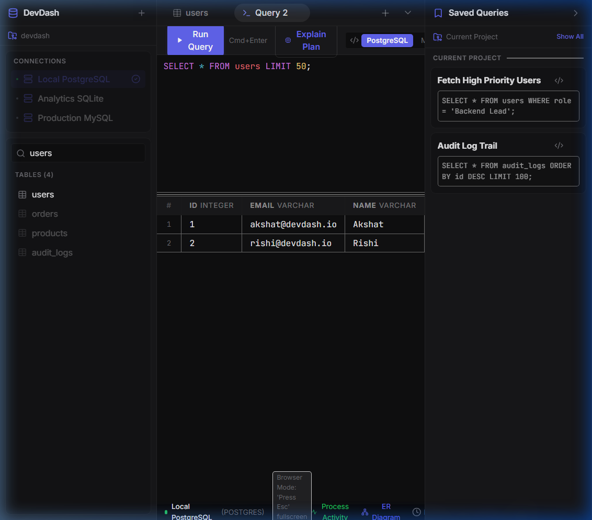

<div align="center">

# ⚡ DevDash
### The Ultra-Fast, Open-Source Native Database GUI Client

[](https://tauri.app/)
[](https://www.rust-lang.org/)
[](https://react.dev/)
[](LICENSE)
[](https://github.com/GUNPARK-GOOKIM/DevDash)

**DevDash** is a next-generation desktop database client engineered with a **Tauri 2.0 + Rust core** and a high-performance **React 18 TypeScript** frontend. Built to replace bloated 300MB+ Electron database tools, DevDash uses **less than 20MB of RAM** while delivering TablePlus ergonomics, git-style transactional diff staging, visual query execution plan trees, 100% offline local AI, and enterprise compliance tooling.

[Features](#-key-features) • [Download](#-download--installation) • [Architecture](#-architecture) • [Security & OS Bypass](#-os-security--bypass-guide) • [Developer Setup](#-developer-quickstart)

</div>

---

<div align="center">
  
</div>

---

## ✨ Key Features

### 🛡️ Git-Style Transaction Staging & Safe Mode
- **Review Before Commit**: Edits made in the virtual grid are staged locally as color-coded cell diffs (`old_value → new_value`). Nothing touches production until you review and click **Apply Staged Edits**.
- **Safe Mode Shield**: Destructive SQL queries (`DROP`, `TRUNCATE`, or `UPDATE`/`DELETE` without a `WHERE` clause) trigger a high-visibility warning modal with query analysis before execution.

### 🤖 100% Offline Local AI SQL Assistant
- **Privacy-First AI**: Connect directly to your local **Ollama** instance (`qwen2.5-coder`, `llama3`, `codellama`) for zero-latency, 100% offline natural-language-to-SQL generation.
- **Cloud LLM Support**: Optionally configure Anthropic Claude or OpenAI API keys.
- **Cmd+K Command Palette**: Press `Cmd+K` anywhere in the app to prompt AI for SQL queries, schema refactoring, or query optimization suggestions.

### ⚡ Blazing Performance (~20MB RAM Footprint)
- **Rust Engine Core**: Multi-pool database execution managed by `sqlx::AnyPool` and concurrent `DashMap` storage in native Rust binaries.
- **60fps Virtualized Data Grid**: Render datasets with 100,000+ rows smoothly using `@tanstack/react-virtual`.
- **Chunked Result Streaming**: Stream dynamic query results over Tauri IPC in 500-row chunks to prevent RAM bloating.

### 📊 Visual EXPLAIN & Real-Time Bento Health Telemetry
- **Visual `EXPLAIN ANALYZE` Cost Tree**: Inspect execution plan node costs, sequential vs. index scan alerts, and shared buffer hit/read ratios in an interactive visual tree card graph.
- **Recharts Bento Telemetry**: 6-card real-time telemetry dashboard monitoring CPU, RAM, active connections, table locks, buffer pool cache hit rate, slow query loggers, and TCP latency pinging.

<div align="center">
  
  
</div>

### 🔑 NoSQL & Document Inspector Viewports
- **Redis Memory Browser**: Browse key namespaces with live TTL countdown counters, memory size indicators, key search, and data type badges (`string`, `hash`, `list`, `set`, `zset`, `stream`, `json`).
- **MongoDB Document Browser**: Collapsible BSON document collection tree view with document size metrics and JSON document inspector.

### 🛡️ Enterprise Compliance & Security
- **SOC2 & HIPAA Audit Trail**: Append-only JSONL event logger (`audit_log.jsonl`) recording user credentials, timestamps, connection names, executed SQL, affected rows, and client IP addresses with 1-click JSON export.
- **Data Masking & PII Protection**: Automatic pattern-based field masking (`ssn`, `credit_card`, `password`, `phone`, `email`) with full masking (`••••••••`), partial email masking, or SHA-256 field hashing for GDPR compliance.
- **Live DDL Schema Diff & Sync**: Compare live database schemas across environments (`Development` vs. `Production`) and generate multi-statement `ALTER TABLE` / `CREATE TABLE` migration DDL scripts.
- **AES-256-GCM Encrypted Backups**: Export and import database connection profiles and saved queries securely using passphrase-protected AES-256-GCM encryption.

### 🪄 Visual Query Builder & Mock Seed Generator
- **Visual No-Code Builder**: Drag-and-drop visual block query builder for SELECT, JOIN, WHERE filters, GROUP BY, and ORDER BY without writing raw SQL.
- **Synthetic Seed Generator**: 1-click synthetic data generator populating tables with 100 to 5,000 realistic rows (names, emails, prices, dates, UUIDs, IPs, coordinates) matching schema data types.

---

## 🏗️ Architecture

DevDash is structured as a decoupled desktop application with a high-performance **Rust** engine communicating with a **React 18** frontend over Tauri's asynchronous IPC bridge.

```
┌────────────────────────────────────────────────────────────────────────┐
│                        DevDash Desktop App                             │
├────────────────────────────────────────────────────────────────────────┤
│  Frontend (React 18 + TypeScript + Tailwind CSS)                       │
│  - Virtualized TableGrid (@tanstack/react-virtual)                     │
│  - Monaco SQL Editor & Auto-complete                                   │
│  - Recharts Bento Telemetry & React Flow ERD Diagram                   │
│  - Local AI Bar (Ollama / Claude / OpenAI Bridge)                      │
├────────────────────────────────────────────────────────────────────────┤
│                      Tauri v2 Async IPC Bridge                         │
├────────────────────────────────────────────────────────────────────────┤
│  Backend Core (Rust Engine)                                            │
│  - sqlx::AnyPool Multi-Database Connection Pool                        │
│  - Native ssh2 TCP Port Forwarding Tunnel Daemon                       │
│  - Keyring OS Keychain Credentials Isolation                           │
│  - Append-Only SOC2 Audit Logger & AES-256-GCM Backup Exporter         │
└────────────────────────────────────────────────────────────────────────┘
```

<div align="center">
  
</div>

---

## 🌐 Supported Database Engines

| Engine Category | Supported Databases | Drivers & Protocols |
|---|---|---|
| **Relational SQL** | PostgreSQL, CockroachDB, Amazon Redshift, YugabyteDB | Native Rust `sqlx-postgres` |
| **MySQL & MariaDB** | MySQL 5.7+, MySQL 8.0+, MariaDB, SingleStore | Native Rust `sqlx-mysql` |
| **Embedded SQL** | SQLite 3, DuckDB | Native Rust `sqlx-sqlite` |
| **Enterprise SQL** | Microsoft SQL Server (T-SQL), Oracle SQL, ClickHouse | Native TDS / REST TCP Protocol |
| **NoSQL Key-Value** | Redis, KeyDB, Dragonfly | Redis RESP TCP Protocol |
| **NoSQL Document** | MongoDB, Amazon DocumentDB | MongoDB BSON Protocol |
| **Cloud IAM Databases** | AWS Redshift (IAM/STS), GCP BigQuery (Service Account), Azure SQL (AD Tokens) | Cloud IAM Auth Protocol Builders |

---

## 💻 Download & Installation

### Option 1: Direct Download (Pre-Compiled Binary)
Download the latest installer for your operating system directly from GitHub Releases:

- **🪟 Windows**: [`DevDash-Setup-x64.exe`](../../releases/latest) or `.msi`
- **🍏 macOS**: [`DevDash-x64-arm64.dmg`](../../releases/latest) (Apple Silicon M1/M2/M3 & Intel)
- **🐧 Linux**: [`DevDash.AppImage`](../../releases/latest) or `.deb`

👉 **[Go to GitHub Releases](../../releases/latest)**

---

## 🛡️ OS Security & Bypass Guide

Because DevDash is an open-source project and installers are compiled directly from source without paid corporate developer certificates, macOS Gatekeeper and Windows SmartScreen may display a security prompt on initial launch.

### 🍏 macOS Fix (If blocked by Gatekeeper):
* **Method 1 (Right-Click Open - Recommended)**: Right-click `DevDash.app` in Finder → Click **Open** → Click **Open Anyway**.
* **Method 2 (Terminal Command)**: Open Terminal and run:
  ```bash
  xattr -d com.apple.quarantine /Applications/DevDash.app
  ```
* **Method 3 (Allow Anywhere)**: Open Terminal and run `sudo spctl --master-disable`, then select "Anywhere" in **System Settings → Privacy & Security**.

### 🪟 Windows Fix (If blocked by SmartScreen):
* When the blue "Windows protected your PC" dialog appears, click **More info** → Click **Run anyway**.

---

## 🚀 Developer Quickstart

To build and run DevDash locally from source:

### Prerequisites
- [Node.js v18+](https://nodejs.org/)
- [Rust & Cargo toolchain](https://www.rust-lang.org/tools/install)
- [Tauri CLI v2](https://tauri.app/v1/guides/getting-started/prerequisites)

### 1. Clone the Repository
```bash
git clone https://github.com/GUNPARK-GOOKIM/DevDash.git
cd DevDash
```

### 2. Install Dependencies
```bash
npm install
```

### 3. Run in Development Mode
```bash
npm run dev
```

### 4. Build Production Desktop Installer
```bash
npm run tauri build
```
*(The compiled installers will be generated in `src-tauri/target/release/bundle/`)*

---

## 🤝 Contributing

Contributions are always welcome! Whether it's reporting bugs, submitting feature requests, or opening pull requests:

1. Fork the Project repository
2. Create your Feature Branch (`git checkout -b feature/AmazingFeature`)
3. Commit your Changes (`git commit -m 'feat: add AmazingFeature'`)
4. Push to the Branch (`git push origin feature/AmazingFeature`)
5. Open a Pull Request

---

## 📄 License

Distributed under the **MIT License**. See [`LICENSE`](LICENSE) for details.

<div align="center">
  <sub>Built with ❤️ by the DevDash Engineering Team. Crafted with Rust, Tauri, and React.</sub>
</div>
