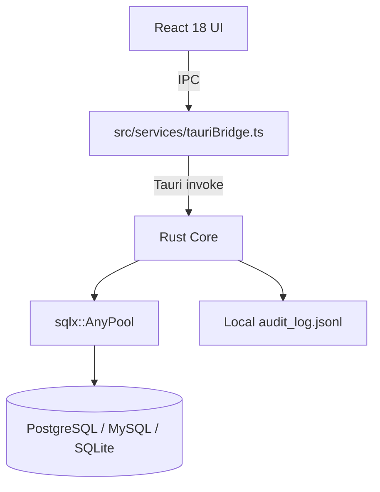

<div align="center">

# ⚡ DevDash
### Local-First Database Engineering Platform & Native GUI Client

[](https://tauri.app/)
[](https://www.rust-lang.org/)
[](https://react.dev/)
[](LICENSE)
[](https://github.com/GUNPARK-GOOKIM/DevDash)

**DevDash** is a **local-first native database GUI client** built with **Tauri 2.0 + Rust** and **React 18 TypeScript**. Core SQL workflows (connect, introspect, query, stage/edit, export/import) target **PostgreSQL, MySQL/MariaDB, and SQLite** (plus Postgres wire-compat engines CockroachDB/Redshift). Status of each capability is tracked in the matrix below — verified from code and tests, not marketing copy.

[Architecture Reference](docs/ARCHITECTURE.md) • [Capability Status](#-capability--status-matrix) • [Key Features](#-key-features) • [Download](#-download--installation) • [OS Bypass Guide](#-os-security--bypass-guide)

</div>

---

<div align="center">
  <h3>📹 Live Workspace Interaction & Animation</h3>
  
</div>

---

## 📊 Capability & Status Matrix

Status meanings: **Complete** = end-to-end from UI through Rust IPC to real engines · **Partial** = real backend pieces but incomplete UX/wiring · **UI prototype** = frontend demo data only · **Missing** = not implemented.

| Engine & Feature Capability | Status | Evidence |
|-----------------------------|:------:|----------|
| **SQL drivers: Postgres / MySQL / MariaDB / SQLite** | ✅ Complete | `sqlx` features in `Cargo.toml`; `pool.rs` + `introspection.rs` |
| **CockroachDB / Redshift** | ⚠️ Partial | Treated as Postgres wire protocol; not separately tested |
| **MSSQL / Oracle / Snowflake / DuckDB / BigQuery / Turso** | ❌ Missing | UI options only; backend rejects unsupported engines |
| **Redis / MongoDB / Cassandra** | ❌ Missing | No RESP/BSON drivers; workspace shows an explicit unavailable notice |
| **Connect / introspect / run SQL / stream results** | ✅ Complete | `commands.rs`, `executor.rs`, `tauriBridge.ts` (500-row chunked stream) |
| **Multi-connection workspaces** | ✅ Complete | Multiple pools stay open; switch without disconnect; session restore |
| **Transaction manager** | ✅ Complete | BEGIN / COMMIT / ROLLBACK on held connection; queries route into open TX |
| **Query profiling** | ✅ Complete | EXPLAIN / EXPLAIN ANALYZE (PG/MySQL/SQLite) with plan nodes |
| **Connection diagnostics** | ✅ Complete | Version, user, size, latency, privilege/connection checks |
| **Migration apply workflow** | ✅ Complete | Diff → dry-run / transactional apply + local migration run history |
| **Workspace/session persistence** | ✅ Complete | Tabs, connections, connected IDs restored (passwords in keychain) |
| **Multi-schema object explorer** | ✅ Complete | Hierarchical sidebar: schemas → tables / views; schema-qualified SQL |
| **Views in catalog** | ✅ Complete | Listed under Views folders; openable in browser (PK-based edit rules apply) |
| **Schema-aware SQL autocomplete** | ✅ Complete | `autocomplete.rs` + CodeMirror `lang-sql` schema map (tables/columns) |
| **Multi-statement execution + result tabs** | ✅ Complete | Quote-aware splitter; one result tab per statement |
| **Query cancel** | ✅ Complete | AbortHandle map + Cancel button in SQL editor |
| **Server-side table pagination** | ✅ Complete | `LIMIT/OFFSET` + `COUNT(*)` using Settings page size |
| **FK-aware introspection + ERD** | ✅ Complete | Live FK catalog on columns; ERD loads full schema with relation edges |
| **Persisted query history panel** | ✅ Complete | App SQLite history + side panel (footer → History) |
| **Connection read-only mode** | ✅ Complete | Blocks write/DDL from editor and runner |
| **Git-style staged cell edits + transactional commit** | ✅ Complete | `staged_edits.rs` applies escaped `UPDATE`s in a transaction; UI stages + commit tab wired |
| **Safe Mode destructive SQL gate** | ✅ Complete | `safe_mode.rs` + confirmation modal |
| **OS keychain passwords** | ✅ Complete | `credentials.rs` via `keyring` |
| **SSH tunnel** | ⚠️ Partial | `ssh_tunnel.rs` opens local forward; session-per-connection is heavy / limited |
| **Local AI (Ollama) + cloud LLM providers** | ⚠️ Partial | Browser `fetch` to Ollama/OpenAI/Claude from UI — works when configured; not embedded offline AI |
| **EXPLAIN plan visualizer** | ✅ Complete | `ExplainVisualizer.tsx` parses live PostgreSQL / MySQL / SQLite `EXPLAIN` JSON trees |
| **Health / metrics grid** | ⚠️ Partial | Live metrics IPC for PG/MySQL/SQLite; QPS/slow queries depend on engine stats extensions |
| **Routines manager** | ✅ Complete | Live catalog queries (`pg_proc` / `information_schema.ROUTINES` + triggers); execute / open in console |
| **Roles / privilege matrix** | ✅ Complete | Live `pg_roles` / `mysql.user` + `role_table_grants` / table privileges |
| **Process manager** | ✅ Complete | Live `pg_stat_activity` / `PROCESSLIST` + kill via `pg_cancel_backend` / `KILL QUERY` |
| **Command palette** | ✅ Complete | Mounted; **Cmd/Ctrl+P** searches tables, connections, queries, and commands |
| **Audit log (local JSONL)** | ⚠️ Partial | Append-only JSONL + IPC reader; **not** SOC2/HIPAA certified |
| **Schema diff (connected DBs)** | ✅ Complete | Live table/column compare via `generate_migration_sql` / `schema_migration.rs` |
| **Per-table migration SQL helper** | ✅ Complete | Backend `schema_migration.rs` + Schema Diff modal over two connected databases |
| **PII masking engine** | ✅ Complete | Rules persist; applied to grid display **and** CSV/JSON/JSONL/Markdown/SQL exports (HASH mode is a stable fingerprint, not crypto SHA-256) |
| **CSV import** | ✅ Complete | Backend CSV import with type coercion + failed-row report |
| **SQL dump import** | ✅ Complete | Multi-statement script runner (stops on first error) |
| **Full-table server export** | ✅ Complete | `export_table_data` with optional WHERE (CSV/JSON/SQL INSERT dump) |
| **Live CREATE TABLE DDL + indexes** | ✅ Complete | `ddl.rs` generates PK/FK/index DDL from catalog; Structure view |
| **Staged INSERT / DELETE rows** | ✅ Complete | Grid Add/Delete Row → transactional commit (with UPDATEs) |
| **Visual query builder** | ⚠️ Partial | Frontend SQL generator; no server validation |
| **Mock data generator** | ✅ Complete | Client-side synthetic rows + batched `INSERT` against the open table |
| **Virtualized grid + TSV copy** | ✅ Complete | `@tanstack/react-virtual` windowed rows; multi-cell TSV copy |
| **Encrypted connection export & QR** | ✅ Complete | `encrypted_export.rs` + Web Crypto PBKDF2/AES-256-GCM string export & camera QR scanner |
| **Mobile touch adaptation** | ✅ Complete | `MobileViewport.tsx`, `MobileBottomNav.tsx`, `MobileDrawer.tsx`, `useMediaQuery.ts` |
| **Parquet export** | ❌ Missing | UI option disabled; binary Parquet writer not implemented |
| **Cloud IAM auth** | ❌ Missing | Struct stub only (`CloudIamConfig`) |
| **&lt;20MB RAM claim** | ❓ Unverified | Not measured in CI |

---

## 📸 Interactive Workspace Showcase

<div align="center">
  
</div>

<div align="center">
  
  
</div>

<div align="center" style="margin-top: 16px;">
  
  
</div>

---

## 🏗️ Architecture & System Execution Flow



<div align="center">
  
</div>

---

## ✨ Key Features

### 🛡️ Git-Style Transaction Staging & Safe Mode
- **Review Before Commit**: Edits made in the virtualized grid are staged locally as color-coded cell diffs (`old_value → new_value`). Nothing touches production until you review and click **Apply Staged Edits** / **Commit** on the Staging tab.
- **Safe Mode Shield**: Destructive SQL queries (`DROP`, `TRUNCATE`, or `UPDATE`/`DELETE` without a `WHERE` clause) trigger a high-visibility warning modal with query analysis before execution.

### 🤖 Optional AI SQL Assistant
- **Local Ollama**: When enabled in Settings, the UI calls your local Ollama HTTP API for NL→SQL (schema context is sent from the client).
- **Cloud LLM Support**: Optional OpenAI-compatible / Anthropic endpoints via API key (network required).
- **Cmd+K**: Focuses the AI bar when AI is enabled. **Cmd/Ctrl+P** opens the command palette.

### 🔐 Offline AES-256 Connection Sharing & QR Scanner
- **Zero-Trust Encryption**: Share database connection profiles securely using PBKDF2 + AES-256-GCM authenticated encryption.
- **Copyable Text & QR Codes**: Export connection profiles as Base64/JSON strings (Slack/Email friendly) or visual QR codes.
- **Mobile Camera Decoder**: Scan QR codes using the device camera to import profiles.

### 📱 Mobile Touch Viewport Adaptation
- **Ergonomic Touch Drawer**: Slide-over drawer for switching connections and selecting tables on screens `< 768px`.
- **Bottom Touch Navigation Bar**: Profiles, Tables, Console, Staging, and Settings with safe-area notch support (`env(safe-area-inset-bottom)`).

### ⚡ Native Performance Path
- **Rust Engine Core**: Multi-pool database execution managed by `sqlx::AnyPool`, with dedicated native driver routing (`bb8-tiberius`, `sqlx::PgPool`, `sqlx::MySqlPool`) for enterprise compliance and type safety across 16+ dialects.
- **Virtualized Data Grid**: Uses `@tanstack/react-virtual` for large result sets (windowed row rendering).
- **Server-Side Pagination**: Table browser pages via `LIMIT/OFFSET` with configurable page size (Settings).
- **Chunked Result Streaming**: Optional stream of query results over Tauri IPC in 500-row chunks.

### 🧠 SQL Editor (DataGrip-class basics)
- **Schema Autocomplete**: Table/column completion from live catalog after connect.
- **Multi-Statement Scripts**: Run a full script; each statement gets its own result tab.
- **Cancel Running Query**: Stop mid-flight queries from the editor toolbar.
- **Read-Only Connections**: Connection flag blocks write/DDL paths.

### 🔌 Multi-Connection Workspaces
- Keep several database pools open at once; switch without tearing down the previous session.
- Per-connection catalog/autocomplete cache; status bar shows **N open** connections.
- Workspace session restore reconnects prior pools and restores tabs (credentials via OS keychain).

### 🔁 Transaction Manager
- Explicit **Begin / Commit / Rollback** bar above the workspace.
- While a transaction is open, SQL from the editor runs on the held connection until commit/rollback.

### 📈 Profiling, Diagnostics & Monitoring
- **Profile**: EXPLAIN / EXPLAIN ANALYZE with plan node breakdown (Postgres JSON, MySQL, SQLite QUERY PLAN).
- **Diagnose**: server version, user, DB size, latency, connection counts, catalog checks.
- **Health** grid continues to surface live engine metrics where available.

### 🚚 Migration Workflow
- Schema Diff compares two connected databases, then **Dry-run** or **Apply to Target** inside a transaction.
- Migration runs are logged locally for audit/history.

### 🗂️ Database Object Explorer (TablePlus-style)
- **Multi-schema tree**: Postgres/Cockroach/Redshift list every user schema (not just `public`).
- **Tables & Views**: Separate collapsible folders per schema with live counts.
- **Schema-qualified paths**: Opening `analytics.events` runs against the correct schema; FK/index/DDL follow.
- **Filter**: Search across schema, table, and view names.

### 🗺️ Schema Intelligence
- **Foreign Keys**: Column introspection marks FKs with target table/column.
- **Indexes**: Structure view lists unique/primary/secondary indexes from the live catalog.
- **CREATE TABLE DDL**: One-click DDL export with PK, FK, and index statements.
- **ERD**: Opening Schema Visualizer loads columns + FK edges for base tables (batched).
- **Query History**: Local persistent history with re-run from the History side panel.

### 📦 Data Movement
- **Full-table export**: Server-side CSV / JSON / SQL INSERT dump (optional WHERE), not just the current page.
- **CSV import**: Typed bulk insert with per-row failure reporting.
- **SQL dump import**: Run multi-statement scripts against the active connection.
- **Grid row ops**: Stage INSERT (Add Row) and DELETE for selected rows, then commit transactionally.

### 🧰 Admin & Schema Tools
- **Routines & Triggers**: Browse and execute functions/procedures from live database catalogs (Postgres/MySQL).
- **Roles & Privileges**: Inspect roles/users and table-level grants from catalog views.
- **Process Manager**: List and cancel backend sessions (Postgres `pg_stat_activity`, MySQL `PROCESSLIST`).
- **Schema Diff**: Compare two **connected** databases and generate `ALTER TABLE` migration SQL for column differences.
- **Mock Data Seeding**: Generate synthetic rows and batch-`INSERT` them into the open table.
- **PII Masking**: Pattern-based field masking on the grid and on exported files.

---

## 💻 Download & Installation

### Option 1: Direct Download (Pre-Compiled Binaries & Installers)
Download the latest installer or APK for your platform directly from GitHub Releases:

- **🪟 Windows**: [`DevDash-Setup-x64.exe`](https://github.com/GUNPARK-GOOKIM/DevDash/releases/latest) or `.msi`
- **🤖 Android**: [`DevDash_arm64-v8a.apk`](https://github.com/GUNPARK-GOOKIM/DevDash/releases/latest) *(Includes camera QR code scanner & mobile touch drawer)*
- **🍏 macOS**: [`DevDash-x64-arm64.dmg`](https://github.com/GUNPARK-GOOKIM/DevDash/releases/latest) (Apple Silicon M1/M2/M3 & Intel)
- **🐧 Linux**: [`DevDash.AppImage`](https://github.com/GUNPARK-GOOKIM/DevDash/releases/latest) or `.deb`

👉 **[Go to GitHub Releases (Download APK & Installers)](https://github.com/GUNPARK-GOOKIM/DevDash/releases/latest)**

---

## 🛡️ OS Security & Bypass Guide

Because DevDash is an open-source project and installers are compiled directly from source without paid corporate developer certificates, macOS Gatekeeper and Windows SmartScreen may display a security prompt on initial launch.

### 🍏 macOS Fix (If blocked by Gatekeeper):
* **Method 1 (Right-Click Open - Recommended)**: Right-click `DevDash.app` in Finder → Click **Open** → Click **Open Anyway**.
* **Method 2 (Terminal Command)**: Open Terminal and run:
  ```bash
  xattr -d com.apple.quarantine /Applications/DevDash.app
  ```
* **Method 3 (Allow Anywhere)**: Open Terminal and run `sudo spctl --master-disable`, then select "Anywhere" in **System Settings → Privacy & Security**.

### 🪟 Windows Fix (If blocked by SmartScreen):
* When the blue "Windows protected your PC" dialog appears, click **More info** → Click **Run anyway**.

---

## 🚀 Developer Quickstart & Verification

```bash
# 1. Clone the Repository
git clone https://github.com/GUNPARK-GOOKIM/DevDash.git
cd DevDash

# 2. Install Frontend Dependencies
npm install

# 3. Type-check Frontend
npx tsc --noEmit

# 4. Run Architecture Integrity Audit
python scripts/check-architecture.py

# 5. Run Rust unit/integration tests
cd src-tauri && cargo test --lib && cd ..

# 6. Run in Development Mode (Vite only, or full Tauri)
npm run dev
# npm run tauri dev

# 7. Compile Production Desktop Installers
npm run build
npm run tauri build
```

**Supported engines in the Rust backend:** PostgreSQL, MySQL, MariaDB, SQLite, plus Postgres wire-compat CockroachDB/Redshift. Other dialect names in the connection UI are rejected at connect time.

---

## 📄 License

Distributed under the **Apache License 2.0**. See [`LICENSE`](LICENSE) for details.

<div align="center">
  <sub>Built with ❤️ by the DevDash Engineering Team. Crafted with Rust, Tauri, and React.</sub>
</div>
